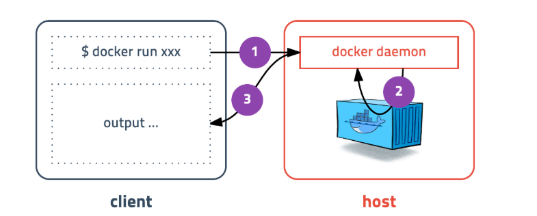
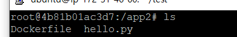

## docker

---------------

### 설치 
```
curl -fsSL https://get.docker.com/ | sudo sh
```

쓰면 사용 os 에 맞게 스크립트 형식으로 다운 받아줌 

```
sudo usermod -aG docker $USER # 현재 접속중인 사용자에게 권한주기
sudo usermod -aG docker your-user # your-user 사용자에게 권한주기
```

docker version 명령어를 통해 정상 설치 인지 확인 할 수 있음. Permission deny 가 출력되면 권한 주고 재 로그인 했는지 체크


--------------------

### 정보

docker 는 클라이언트와 서버로 구성되어있습니다.

커맨드를 입력하면 클라이언트가 도커 서버에 명령어를 전달하고 결과를
반환받는 구성입니다.




도커서버가 설치된 서버 

```
docker info
```
명령어를 통해 기본 정보를 확인 할 수 있슴.


docker run 하면 이미지 없을시 pull 해서 실행

**레지스트리 vs 레지스토리**

- 레지스트리 : 이미지가 저장되는 곳 ex) docker hub, ecr
- 레지스토리 : 이름은 같지만 태그가 다른 이미지의 논리적 모음

*도커 클라이언트의 기본 레지스토리는 도커 허브입니다.*


**이미지 구성**

이미지는 여러 레이어로 이루어져 있습니다. <br>
이미지를 pull 받으면 레이어들이 독립적으로 저장됩니다. <br>
이미지를 실행시키면 특정 위치에 여러 레이어들이 특정 위치에 마운트되어 실행됩니다. <br>
이 레이어들은 이미지 속성을 가르키기 때문에 **절대 변하지 않습니다.** 그리고 그 위에 마지막으로 컨테이너 전용 쓰기 가능한 레이어를 한 층 더 쌓고, 컨테이너에서 일어나는 모든 변경 사항을 이 레이어에 저장합니다. 


**이미지 빌드**

- 이미지 생성하는 것을 말함
DockerFile 과 commit 명령어를 통해 빌드 할 수있음.

Dockerfile은 파일 명으로 한 텍스트 파일 

**아래 코드는 Dockerfile 내부 텍스트**

```
FROM python:2.7-slim 
#뒤에 python 부분은 베이스 이미지

WORKDIR /app2
#뒤에 경로는 이미지 내에서 RUN, CMD< ENTRYPOINT 의 명령이 실행될 디렉토 리 위치

ADD . /app2
#현재 디렉터리에 있는 파일을 이미지 내부 /app2 에 추가한다는 뜻

RUN pip ~~~
#실행될떄 run 해줌

EXPOSE 80
#80포트 열어줌

ENV ~~
#환경변수 설정

CMD ["python",'hello.py']
#쉘을 사용하지 않고 컨테이너 실행됬을떄 python hello.py 실행
```
빌드 명령 : docker build 

-t : 태그명

**뒤에 . 은 현재 디렉토리의 파일들을 빌드한다는것** 

만약 제외 시킬게 있으면 gitignore 파일처럼 dockerignore 을 설정 
```
docker build -t test:first .
```

**컨테이너 실행**

-d : 데몬
-p : 포트

docker run -d --name "name" 이미지명 


**컨테이너 접속 명령어**

docker exec -it 컨테이너명 /bin/bash
컨테이너를 bash로 접근한다는 뜻



컨테이너 내부에 접속해보면 아래와 같이 app2 폴더 아래에 있음


**이미지 저장**

-o 추출 파일명

```
docker save -o ubuntu_14_04.tar ubuntu:14.04

```
바이너리 파일로 저장할때 docker save 명령어로 가능합니다.

**이미지 로드**

-i 로드 파일명
```
docker load -i ubuntu_14_04.tar 
```


참고

[초보를 위한 도커안내서](https://subicura.com/2017/01/19/docker-guide-for-beginners-2.html)

[도커이미지 빌드하기](https://suwoni-codelab.com/docker/2018/06/11/Docker-Dockerfile/)

[컨테이너 명령어](https://swiftymind.tistory.com/82)

[컨테이너 삭제](https://brunch.co.kr/@hopeless/10)
<<<<<<< HEAD

[도커파일 구조](https://rampart81.github.io/post/dockerfile_instructions/)
=======
>>>>>>> adada20f219b2297304562e0b4788f58339ccc60
